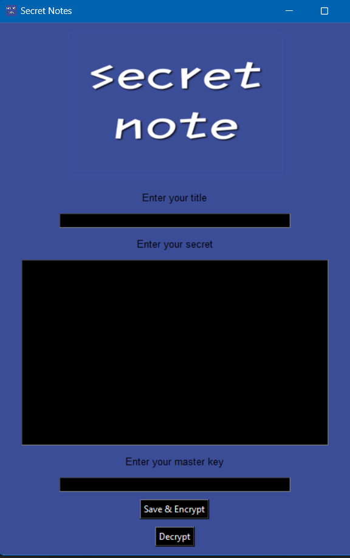

# Secret Notes

Secret Notes is a Python application that allows you to encrypt and save your secret notes securely. You can also decrypt your notes using a master key.

## Features

- **Encryption**: Encrypt your secret notes using a master key for added security.

- **Decryption**: Decrypt your encrypted notes by providing the correct master key.

- **Save Notes**: Save your encrypted notes in a text file for future reference.

## How to Use

1. Clone the project to your computer or download it as a zip file.

2. Make sure you have Python installed on your system.

3. Run the application by executing the `secret_notes.py` file.

4. Ensure you have the necessary Python libraries installed by running the following commands:
   
   pip install tkinter pillow

5. Enter your secret note in the "Enter your secret" field.

6. Enter a master key in the "Enter your master key" field. This key will be used for encryption and decryption.

7. Click the "Save & Encrypt" button to save and encrypt your secret note. The encrypted note will be stored in a text file named "mysecret.txt."

8. To decrypt a note, enter the encrypted text in the "Enter your secret" field and provide the correct master key. Click the "Decrypt" button.

9. Your decrypted secret note will appear in the "Enter your secret" field.

## Screenshot

